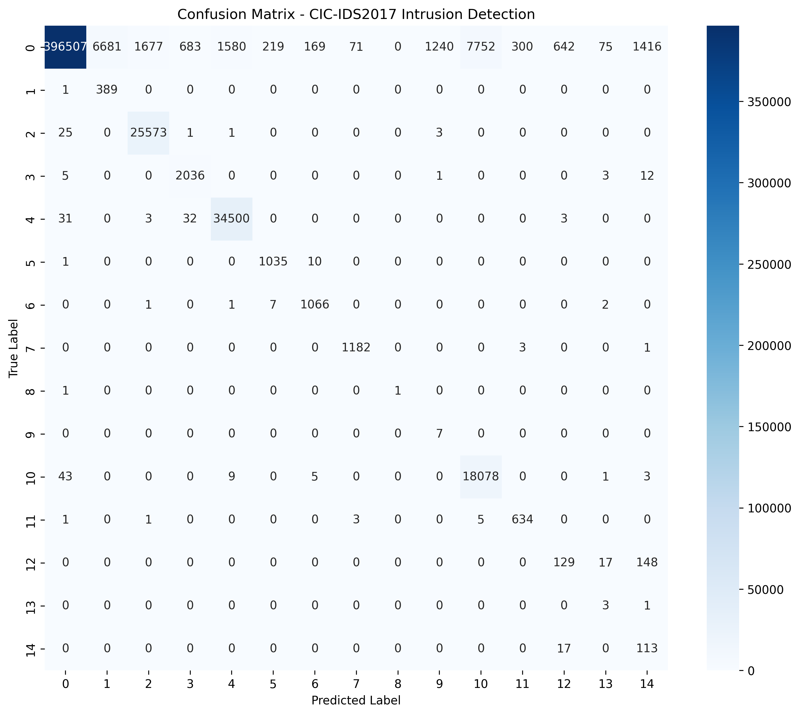

# Intrusion Detection System (IDS)

A deep learning-based Hybrid CNN-LSTM model for real-time network intrusion detection. This project uses the CIC-IDS2017 dataset and deploys a Flask web application for classifying network traffic into 15 different attack types.

---

## Overview

This project implements an advanced network security solution that combines Convolutional Neural Networks (CNN) for spatial feature extraction and Long Short-Term Memory (LSTM) networks for temporal pattern recognition. The hybrid architecture enables comprehensive analysis of network traffic patterns for intrusion detection.

The model is trained on the CIC-IDS2017 dataset with 78 network flow features and classifies traffic into the following categories:

- BENIGN (Normal traffic)
- DoS/DDoS (Denial of Service attacks)
- Port Scan (Network reconnaissance)
- Web Attack (HTTP/HTTPS exploits)
- Brute Force (FTP-Patator, SSH-Patator)
- Botnet and other attack types

---

## Model Performance

| Metric | Score |
|--------|-------|
| Weighted F1-Score | 96.46% |
| Macro F1-Score | 62.47% |
| Accuracy | 95%+ |
| Test Samples | 504,160 |

### Confusion Matrix


### Classification Report Highlights
- BENIGN Detection: 97% F1-score
- PortScan Detection: 98% F1-score
- DoS/DDoS Detection: 97% F1-score
- Web Attack Detection: 92% F1-score

---

## Live Deployment

The application is deployed and accessible online. Access the live intrusion detection interface for real-time classification of network traffic with instant predictions and confidence scores.

Deployment URL: [Render Deployment Link]

---

## Project Structure

```
Intrusion_Detection_Project/
├── app.py                          # Flask web application
├── requirements.txt                # Python dependencies
├── Templates/
│   └── index.html                  # Web interface
├── Models/
│   └── cnn_bilstm_best.pth        # Trained model weights
├── Data/
│   ├── Processed_data/            # Processed training data (git ignored)
│   └── archive/                   # Raw dataset (git ignored)
├── Notebooks/
│   ├── 01_Data_Exploration.ipynb
│   ├── 02_Model_Training.ipynb
│   └── 03_Hyperparameter_Tuning.ipynb
├── .gitignore                      # Git ignore file
└── README.md                       # This file
```

---

## Installation

### Prerequisites
- Python 3.8 or higher
- pip package manager
- Git

### Local Setup

```bash
# Clone the repository
git clone https://github.com/YOGESH007-CODING/Intrusion_Detection_Project.git
cd Intrusion_Detection_Project

# Create virtual environment (optional but recommended)
python3 -m venv venv
source venv/bin/activate  # On Windows: venv\Scripts\activate

# Install dependencies
pip install -r requirements.txt

# Run the Flask application
python3 app.py
```

Visit http://localhost:5000 in your web browser to access the application.

---

## Dataset Information

### CIC-IDS2017 Dataset Overview
- Total Samples: 2.5+ million network flows
- Features: 78 network traffic features
- Attack Types: 15 classes (1 benign + 14 attack types)
- Temporal Coverage: Simulated network traffic over 5 days

### Dataset Classes
```
0:  BENIGN             - Normal network traffic
1:  Web Attack        - HTTP/HTTPS-based attacks
2:  DoS              - Denial of Service attacks
3:  DDoS             - Distributed Denial of Service attacks
4:  PortScan         - Network port scanning reconnaissance
5:  Bot              - Botnet command and control traffic
6:  FTP-Patator      - FTP protocol brute force attacks
7:  SSH-Patator      - SSH protocol brute force attacks
8:  Infiltration     - Data exfiltration attacks
9:  Heartbleed       - SSL/TLS vulnerability exploitation
10: Web Attack       - Additional web-based attack variants
11: Brute Force      - SSH brute force attacks
12: Brute Force      - Generic brute force attacks
13: Brute Force      - Additional brute force attack variants
14: Botnet           - Botnet traffic patterns
```

---

## Model Architecture

### CNN-LSTM Hybrid Model

The model combines convolutional and recurrent layers for comprehensive feature extraction:

```
Input (78 features)
    |
    v
Conv1D(32 filters, kernel=3) + ReLU activation
    |
    v
MaxPool1D(kernel=2)
    |
    v
Conv1D(64 filters, kernel=3) + ReLU activation
    |
    v
MaxPool1D(kernel=2)
    |
    v
LSTM(128 hidden units, 2 layers, batch_first=True)
    |
    v
Dropout(0.5)
    |
    v
Dense(15 classes) + Softmax activation
    |
    v
Output (Attack Classification)
```

### Model Specifications
- Convolutional Layers: 2 (filter progression: 32 -> 64)
- LSTM Layers: 2 bidirectional layers with 128 hidden units
- Regularization: Dropout (0.5)
- Loss Function: Focal Loss with class weights
- Optimizer: Adam with learning rate 0.0005
- Total Parameters: Approximately 150,000

---

## Training Details

### Data Balancing Strategy
- Original Distribution: Severe class imbalance (1.6M BENIGN samples vs 17 minority class samples)
- Balancing Technique: SMOTE (Synthetic Minority Over-sampling Technique) + Random Undersampling
- Final Distribution: 100,000 samples per class (1.5M total training samples)

### Training Configuration
- Batch Size: 32
- Maximum Epochs: 100 with early stopping
- Learning Rate: 0.0005
- Early Stopping Patience: 7 epochs without improvement
- Training Duration: Approximately 2 hours on CPU
- Validation Split: 20% of training data

### Class Weight Adjustment
Focal Loss was applied with computed class weights to further handle the remaining class imbalance and improve minority class detection rates.

---

## Usage

### Web Interface

1. Open the application at the deployment URL or http://localhost:5000
2. Enter 78 network features as comma-separated numeric values
3. Click the "Predict Attack" button
4. View results including:
   - Predicted attack classification
   - Confidence percentage
   - Probability distribution across all 15 classes

### Example Input

```
187270.06, 475357.15, 365996.97, 299329.24, 78009.32, 466, 214, 330, 458, 87, 
372, 99, 871, 663, 130, 67221, 64820, 769, 59735, 62955, 64925, 67969, 5311, 
83104, 53707, 6116.53, 70.66, 230.62, 5247.75, 3998.61, 466.66, 9737.56, 2327.71, 
906.06, 6183.86, 382.46, 983.23, 466.76, 859.94, 680.31, 450.5, 13.26, 942.2, 
563.29, 385.42, 15.97, 230.89, 241.03, 683.26, 610.0, 7, 46, 34, 77, 80, 35, 49, 
3, 1, 5, 10397.08, 28385.02, 1565.66, 42114.24, 22487.71, 19757.51, 46332.94, 
36363.6, 3265.41, 5704.44, 5208.34, 9611.72, 8445.34, 7473.2, 5396.92, 5867.51, 
9652.55, 6070.34
```

---

## Technical Stack

| Component | Technology |
|-----------|-----------|
| Backend Framework | Flask 3.1.2 |
| Machine Learning | PyTorch 2.9.0 |
| Frontend | HTML5, CSS3, JavaScript |
| Application Server | Gunicorn |
| Deployment Platform | Render |
| Dataset | CIC-IDS2017 |

---

## Dependencies

```
flask==3.1.2
torch==2.9.0
numpy
gunicorn
werkzeug
```

For CPU-only PyTorch deployment:
```
--extra-index-url https://download.pytorch.org/whl/cpu
torch==2.9.0+cpu
```

---

## Deployment

### Render Deployment (Free Tier)

1. Push source code to GitHub repository
2. Connect GitHub repository to Render dashboard
3. Configure deployment settings:
   - Build Command: pip install -r requirements.txt
   - Start Command: gunicorn app:app
4. Select Free plan tier
5. Deploy application

The application will be live at: https://your-app-name.onrender.com

### Continuous Deployment

Every push to the main branch automatically triggers application rebuild and redeployment on Render.

---

## Model Limitations and Considerations

### Limitations
- Model is optimized for the 78 CIC-IDS2017 features and may not generalize to other feature sets
- Performance on datasets beyond CIC-IDS2017 requires retraining
- Minority attack classes demonstrate lower precision due to inherent dataset imbalance

### Performance Notes
- Initial prediction after application startup requires 30-60 seconds on free tier due to cold start
- Subsequent predictions execute in real-time
- Inference runs on CPU (GPU not required for deployment)

### Future Enhancement Opportunities
- Integration with real-time network packet capture systems
- Implementation of model ensemble techniques for improved accuracy
- GPU-accelerated deployment for faster inference
- Model interpretability features using SHAP or LIME
- REST API development for third-party integration

---

## References

CIC-IDS2017 Dataset: https://www.unb.ca/cic/datasets/

PyTorch Documentation: https://pytorch.org/

Lin, T. Y., Goyal, P., Girshick, R., He, K., & Dollár, P. (2017). Focal Loss for Dense Object Detection. 2017 IEEE International Conference on Computer Vision (ICCV).

---

## Author

Yogesh Sharma
- GitHub: https://github.com/YOGESH007-CODING
- Delhi Technological University (DTU)
- Computer Science, 3rd Year

---

## License

This project is open source and available under the MIT License.

---

## Contributing

Contributions are welcome. Please submit pull requests with detailed descriptions of proposed changes.

---

## Support

For technical issues, questions, or suggestions:
1. Review existing GitHub issues
2. Create new issue with detailed description
3. Include error messages and system information

---

Last Updated: November 10, 2025
Model Version: 1.0
Status: Production Ready